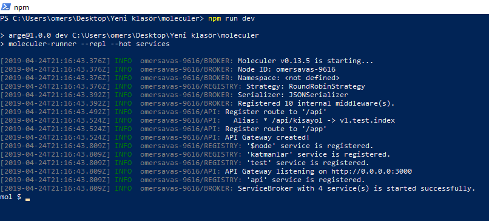
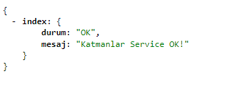
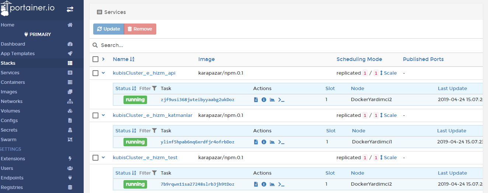

# Moleculer.js Örnek Proje
## Kütahya İl Özel İdaresi - Bilgi işlem müdürlüğü

Kendi projelerimizden biri için yaptığımız, örnek Molekuler.js framework mikroservis çalışmasıdır. Test yönelimli geliştirme için örnek bir test methodu yazılmıştır. Docker swarm ile çalıştırmak için bir compose dosyası eklenmiştir. Test methodları uzaktan çalıştırılabilmesi için api ile sunulmuştur. Bu sayede versiyon değiştirme sonrası yada peryodik olarak servisler test edilebilir.

Tüm api fonksiyonlarını etkileyen bir dönüştürücü sınıfı bulunmaktedır. Bu cevap olarak hazırlanan datanın istenilen formatta sunulmasını sağlar. Halihazırda json (varsayılan)  ve xml formatını desteklemektedir. Bu şekilde; daha sonra oluşacak ihtiyaçlar için -örneğin protobuf- kolayca entegrasyon sağlanabilecektir. Örnek kullanım: http://localhost:3000/api/v1/test/katmanlar?rtype=xml

Opsiyonel olarak chai.expect methodları kullanılabilir.

## Yerelde çalıştırma

Node js ve npm kurulu olmalıdır. Klonu bilgisayarınıza indirdikten sonra komut satırından indirdiğiniz klon içine girerek aşağıdaki komutları çalıştırınız.

`npm install`
`npm run dev`

Servisler başladıktan sonra tarayıcınızdan "http://localhost:3000/api/v1/test/katmanlar" adresine girerek test edebilirsiniz.

## Docker swarm ile çalıştırma

Bu modda çalıştırmak için servisler içerisindeki transporter ayarı: transporter: "nats://localhost:4222" olarak değiştirilmelidir. Klon dizininde aşağıdaki komut çalıştırılır

`docker stack deploy --compose-file /path/to/clone/docker-compose.yml moleculertest`

